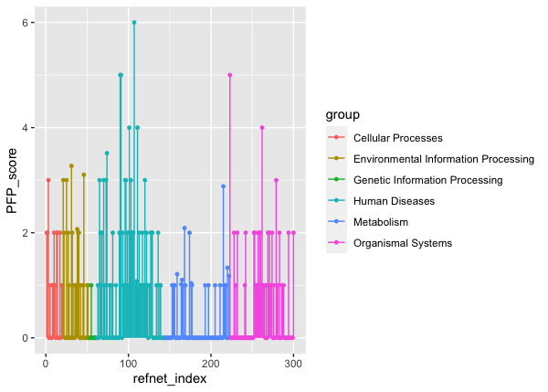
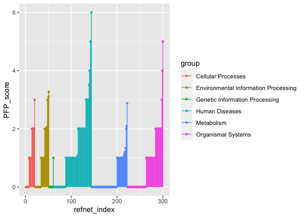

```{r, include=FALSE}
knitr::opts_chunk$set(
  collapse = TRUE,
  comment = "#>",
  fig.align = "center", 
  fig.show = "asis",
  eval = TRUE,
  tidy.opts = list(blank = FALSE, width.cutoff = 60),
  tidy = TRUE,
  message = FALSE,
  warning = FALSE
)
```

## Introduction

Recent a method based on gene expression and kegg pathways' knowledge provides a novel representation of the relationship between a gene list and a pathway known as Pathway Fingerprint. This method was used to describe the relationship between a gene list such as some disease differential expression genes and its related pathways, and to visually compare and parse different diseases by generating a fingerprint overlay. To give a quantitative comparison of the mixed disease DEG-list, we achieve the function of complex scoring system  based on pathways on the open scientific computing platform **R**, and present *PFP* package for fingerprint-based pathway analyzing and comparison of systems. Driven by the research needs of customers, *PFP* provides a unified interface to find most related pathways with a disease or a exprement. In addition, *PFP* can also provide multiscale statistical analysis and visualization, access to the specific attributes of different disease fingerprint.

This manual is a brief introduction to structure, functions and usage of *PFP* package. The PFP package provides a set of functions to support knowledge-based network fingerprint (PFP) framework. A biomedical network is characterized as a spectrum-like vector called “network fingerprint”, which contains scores of basic reference networks. This framework provides a more intuitive way to decipher molecular networks, especially for finding most related pathways and biomarkers, which can help researchers to better understand the the mechanism of biological regulation.

The three main features of *PFP*:

- Basic reference networks generation.
- Realize the comparation between a gene list an a pathway network.
- \item Do a statistic test for the result.

### Installation

*PFP* requires these packages: *igraph*, *plyr*, *ggplot2*, *dplyr*, *clusterProfiler*, *KEGGgraph*,*graph* and *BioNet*. To install *PFP*,there is a `biocLite()`, a wrapper around `install.packages()` provided by Bioconductor, can be used to install both CRAN and Bioconductor packages simply. More details on `biocLite()` is available from [https://www.bioconductor.org/install/](https://www.bioconductor.org/install/). Thus, users can install PFP install the latest released version using `biocLite()` directly:

```{r install-pkg, eval=FALSE}
## install release version of PFP
source("http://bioconductor.org/biocLite.R")
biocLite("PFP")
```

or install the  Bioconductor dependencies package first:

```{r nstall-pkg2, eval=FALSE}
## install release version of PFP
source("http://bioconductor.org/biocLite.R")
biocLite(c("graph","KEGGgraph"))
install.packages("PFP")
```

It also allows users to install the latest development version from github, which requires  *devtools* package has been installed on your system or can be installed using `install.packages("devtools")`. Note that devtools sometimes needs some extra non-R software on your system -- more specifically, an Rtools download for Windows or Xcode for OS X. There's more information about devtools [here](https://github.com/hadley/devtools).

```{r install-pkg-github, eval=FALSE}
## install PFP from github, require biocondutor dependencies package pre-installed 
if (!require(devtools))
  install.packages("devtools")
devtools::install_github("aib-group/PFP")
```

After installation, the \*{PFP} is ready to load into the current workspace by the following codes to the current workspace by typing or pasting the following codes:

```{r load-pkg,eval=TRUE, include=FALSE}
library(PFP)
```


## Analysis Pipeline: from Basic Reference Pathway Networks Generation to Pathwayfingerprint Visualization

We will demonstrate go through an analysis pipeline to illustrate some of the main functions in *PFP*. This pipeline consists of several steps:

1. Basic Reference Network Generation: prepare the well-known biomedical networks as the PFP framework reference networks. Several pathway databases have been developed for biological network research, e.g. KEGG, Reactome - ([https://reactome.org](https://reactome.org)). All of this pathway databases is well-stuied and can be used as the basic reference networks of PFP.
1. Pathway fingerprint calculation: The similarity between a gene list and a biomedical network is calculated.
1. Pathway fingerprint Visualization: Show the pathway fingerprint along all the reference networks. We could observe the differences among biological pathway fingerprint intuitively from visualization.

### Generating well-studied basic reference networks

The basic idea of calculating the network fingerprint is to have the biomedical networks map to well-studied basic networks. KEGG PATHWAY is a collection of manually drawn pathway maps representing our knowledge on the molecular interaction and reaction networks. Since its first introduction in 1995, KEGG PATHWAY has been widely used as a reference knowledge base for understanding biological pathways and functions of cellular processes. The knowledge from KEGG has proven of great value by numerous work in a wide range of fields [@kanehisa2007kegg]. So by default, we take KEGG pathways as basic reference networks in *PFP* by default.


```{r eval=TRUE, echo=TRUE}
## donot run, retrive pathway maps from KEGG database may take several minutes,
## we have pre-stored this data in our package
## PFPRefnet <- load_KEGG_refnet(organism = 'mmu')
data(PFPRefnet)
PFPRefnet <- new(Class = "PFPRefnet",network = network(PFPRefnet),
                 net_info = net_info(PFPRefnet))
# show the kegg reference networks
show_net(PFPRefnet)
```

We defined a new S4 class `PFPrefnet` to store the *PFP* reference networks. *PFP* also provides five kinds of methods for this S4 class:

1. `network()`: Exact the basic reference networks of `PFPRefnet`.
1. `group()`: Obtain the group information, group names, number and the
size of each group,e.g. KEGG pathway database contains seven group pathway maps.
1. `subnet()`: Extract or replace parts of the *PFP* basic reference
networks.
1. `show_net()`: Display of `PFPRefnet`.
1. `net_name()`: Extract the names of reference networks.

```{r keggrefnet-methods,echo=TRUE,eval=TRUE}
## group information of kegg reference networks
refnet_group <- group(PFPRefnet)
refnet_group

## select goup 1 and 2, and subset this two groups
selected_group <- refnet_group$name[c(1,2)]
PFPnet <- subnet(PFPRefnet,selected_group)
show_net(PFPnet)
```

Detailed instructions for this five methods refer to package function help.


### Pathway fingerprint calculation

Pathway fingerprint is calculated by calc_PFP_score.R

```{r sub0, eval=FALSE, echo=TRUE}

data("gene_list")
data("PFPRefnet")

pfp <- calc_PFP_score(gene_list,PFPRefnet)
## set g as the query network

## a subset of kegg_refnet, select the head five networks of group 1, 2

sub0 <- sub_PFP(object = PFP_test,group_name = 
                  unique(ref_net_info(PFP_test)$group)[c(2,4)],
                index = list(1:5,1:5))
## methods of PFP class
refnet_names(sub0)
head(sub0)
```

```{r sub1, eval=FALSE, echo=TRUE}
sub1 <- sub_PFP(object = PFP_test,group_name = 
                  unique(ref_net_info(PFP_test)$group)[c(2,4)],
                index = list(c("mmu01230","mmu01521"),c("mmu04152")),
                index_type = "pathway_id")
## methods of PFP class
refnet_names(sub1)
head(sub1)
```

```{r sub2, eval=FALSE, echo=TRUE}
sub2 <- sub_PFP(object = PFP_test,group_name = 
                  unique(ref_net_info(PFP_test)$group)[c(2,4)],
                index = list(c("MAPK signaling pathway",
                               "Phosphatidylinositol signaling system"),
                             c("Staphylococcus aureus infection",
                               "Leishmaniasis")),index_type = "pathway_name")
## methods of PFP class
refnet_names(sub2)
head(sub2)
```

### Network fingerprint visualization

*PFP* provides the `plot_PFP()` function to visualize the network fingerprint of a single query network.

```{r plot-PFP,echo=TRUE,eval=FALSE,fig.cap='Plot a PFP object',dev='pdf',fig.show='hold',out.width='.8\\linewidth', out.height='.7\\linewidth'}
plot_PFP(sub0)
```

```{r}
knitr::include_graphics("000001.png")
```

```{r plot-PFP-all,echo=TRUE,eval=FALSE,fig.cap='Plot a PFP object',dev='pdf',fig.show='hold',out.width='.8\\linewidth', out.height='.7\\linewidth'}
plot_PFP(PFP_test)
```

```{r}

```

The version number of R and packages loaded for generating the vignette were:

```{r plot-PFP-sort,echo=TRUE,eval=FALSE,fig.cap='Plot a PFP object',dev='pdf',fig.show='hold',out.width='.8\\linewidth', out.height='.7\\linewidth'}
rank_PFP <- rank_PFP(PFP_test,decreasing=F)
plot_PFP(rank_PFP)
```

```{r}

```

## Session Information

The version number of R and packages loaded for generating the vignette were:

```{r echo=FALSE}
sessionInfo()
```

## References
